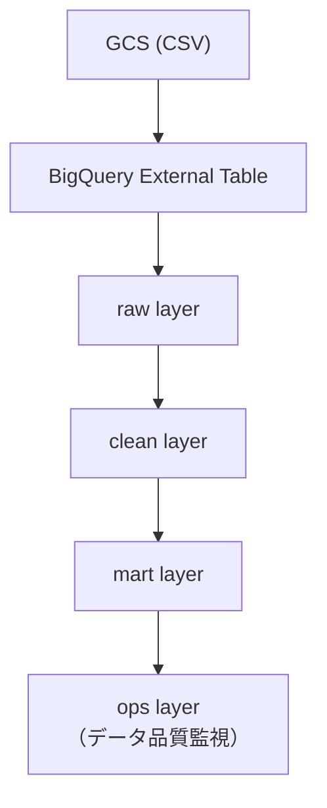

# EC Data Platform (Olist) - Portfolio

## 概要
Olist（公開ECデータ）のCSVをGCSに配置し、BigQuery上に  
**raw / clean / mart / ops** のレイヤを構築するデータ基盤ポートフォリオです。

本プロジェクトでは、実務を意識した以下の構成を実装しています。

---

## アーキテクチャ
GCS (CSV)
↓
BigQuery External Table
↓
raw_olist.orders
↓
clean_olist.orders
↓
mart_olist.*
↓
ops.*

---

## データソース
- Olist Brazilian E-Commerce Public Dataset（CSV）
- 公開ECデータセット（Kaggle）

---

## 実装済み（このリポジトリの現状）
- GCSにCSVを配置（dt=YYYY-MM-DD 配下）
- BigQuery external table（orders_external）を作成
- raw_olist.orders を作成（PARTITION BY ingest_date）
- external → raw へロード（ingest_date, loaded_at, source_file のメタ列付与）
- clean層の整形処理

---

## ディレクトリ構成
- sql
- ├── 10_external
- │   ├── 10_external_orders.sql
- │   └── 11_external_customers.sql
- │
- ├── 20_raw
- │   ├── 20_raw_orders_ddl.sql
- │   ├── 21_raw_orders_insert.sql
- │   ├── 22_raw_customers_ddl.sql
- │   └── 23_raw_customers_insert.sql
- │
- ├── 30_clean
- │   ├── 31_clean_orders_merge.sql
- │   └── 33_clean_customers_merge.sql
- │
- ├── 40_mart
- │   ├── 40_mart_daily_orders_init.sql
- │   ├── 41_mart_daily_orders_merge.sql
- │   ├── 42_mart_customer_daily_metrics_init.sql
- │   └── 43_mart_customer_daily_metrics_merge.sql

---

## レイヤ設計

- raw layer
- **目的**
- ソースデータをそのまま保持する層。
- **テーブル**
- `raw_olist.orders`
- `raw_olist.customers`
- **特徴**
- PARTITION BY `ingest_date`
- external table からロード
- メタデータ列を付与
- **メタデータ列**
- | column | 説明 |
- |------|------|
- | ingest_date | 取り込み日 |
- | loaded_at | ロード時刻 |
- | source_file | GCSファイル名 |
- **ロード方式**
- DELETE + INSERT
- ingest_date単位で再実行可能な冪等パイプライン設計

- clean layer
- **目的**
- rawデータを分析可能な形式へ整形する。
- **テーブル**
- `clean_olist.orders`
- `clean_olist.customers`

- `clean_olist.orders`
- **粒度**
- 1注文 = 1行
- **処理内容**
- 空文字の正規化（TRIM / NULLIF）
- 文字列整形（LOWER）
- 派生列生成（purchase_date）
- データ品質フラグ付与
- order_id単位の重複排除
- MERGEによるUPSERT
- **データ品質列**
- | column | 説明 |
- |------|------|
- | is_purchase_at_parsed | purchase timestampパース成功フラグ |
- | dq_error_reason | データ品質エラー理由 |

- `clean_olist.customers`
- **粒度**
- 1customer_id = 1行
- **処理内容**
- 空文字の正規化（TRIM / NULLIF）
- city / state 文字列整形
- customer_id単位の重複排除
- MERGEによるUPSERT
- **データ品質列**
- | column | 説明 |
- |------|------|
- | is_customer_id_present | customer_id存在フラグ |
- | dq_error_reason | データ品質エラー理由 |
---

## mart layer

- **目的**
- clean層で整形した明細データを日次KPIとして再構成する。
- **テーブル**
- `mart_olist.daily_orders`
- **粒度**
- 1 purchase_date = 1 row
- **指標**
- | column | 説明 |
- |------|------|
- | date | 注文日 |
- | order_count | 注文数 |
- | customer_count | ユニーク顧客数 |
- | delivered_count | 配送完了数 |
- | canceled_count | キャンセル数 |
- **設計意図**
- BIツールでそのまま使えるKPIテーブルを提供
- clean層と責務分離
- MERGE による再実行可能な集計処理
---

## ops layer

**目的**
- raw / clean / mart の品質メトリクスを記録し、異常検知に利用する。

例

- | metric | 説明 |
- |------|------|
- | raw_row_count | rawテーブルの行数 |
- | duplicate_orders | order_id重複数 |
- | invalid_timestamp | 不正timestamp数 |

---

## 実行手順
1. GCSに配置  
   `gs://ec-data-platform-olist/raw/orders/dt=2026-03-05/*.csv`
2. external table 作成  
   `sql/10_external/10_external_orders.sql`
3. raw table 作成  
   `sql/20_raw/20_raw_orders_ddl.sql`
4. rawへロード  
   `sql/20_raw/21_raw_orders_insert.sql`
5. clean生成
   `sql/30_clean/31_clean_orders_merge.sql`

---

# 使用技術
- Google Cloud Storage
- BigQuery
- SQL
- GitHub

---

## 今後の予定
- mart層：日次売上/注文数などKPI集計
- ops層：品質メトリクス記録と異常検知、日次自動実行
- KPIテーブル作成

---

## ポートフォリオ目的
- このプロジェクトでは以下のスキルを示すことを目的としています。
- データ基盤レイヤ設計
- BigQueryパーティション設計
- MERGE / UPSERT
- データ品質管理
- 冪等パイプライン設計